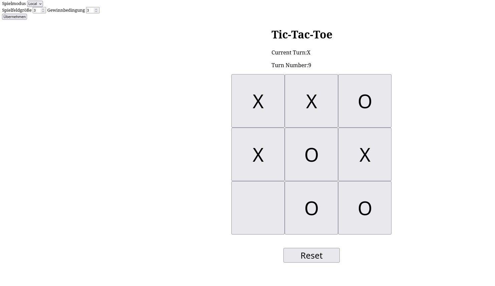

# TicTacToe 👣 (weil Toe checkt ihr?)

Ein simples TicTacToe-Spiel mit anpassbarer Spielfeldgröße, Gewinnbedingung und geplantem Online-Multiplayer-Modus über WebSockets.
Das Projekt ist aktuell in Entwicklung.

---

## 🚀 Features

- **Lokaler Spielmodus** (2 Spieler auf einem Gerät,oder ein Spieler gegen einen Super schweren Bot der den MiniMax alogritmus nutzt. 😎 (bisher noch garkein Bot xD) )
- **Anpassbare Einstellungen** (Boardgröße & Gewinnbedingung)
- **Dynamische UI** Dom wird durch Javascript Code dynamisch angepasst (Cool)
- **(In Arbeit)** Lobby-System und Online-Multiplayer über WebSockets
- **(Geplant)** Chat-Funktion innerhalb von Lobbys

