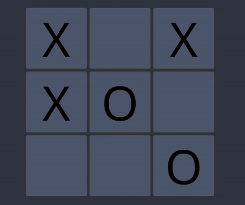
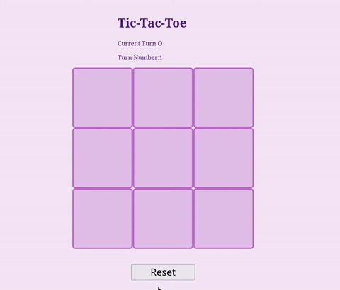

# TicTacToe 👣 (weil Toe checkt ihr?)

Ein nicht mehr ganz so simples TicTacToe-Spiel,
das mittlerweile mehr Over-Engineering enthält als notwendig.

Ursprünglich als kleines JS-Skript gestartet, ist es jetzt ein
TypeScript-Projekt mit Architektur-Patterns, weil... warum nicht?

## Features

### 🎮 Gameplay

* **Flexibles Spiel:** Anpassbare Spielfeldgröße (z.B. 3x3 bis 10x10) und
Gewinnbedingung (3-in-a-row, 4-in-a-row, etc.).
* **Bot-Gegner:** Es gibt einen Singleplayer-Modus gegen einen Bot mit verschiedenen Schwierigkeitsgraden:
    * *Einfach:* Macht zufällige Züge (dumm wie Brot).
    * *Mittel/Schwer:* Nutzt eine "ShortSighted"-Strategie (sieht Gewinnzüge und blockiert, plant aber nicht weit voraus).
    * *(Geplant):* Ein unbesiegbarer Minimax-Bot (kommt noch, versprochen!).
* **Lokaler Multiplayer:** 2 Spieler können klassisch an einem Gerät spielen (Innovativ xD).

### 🎨 UI & Design

* **Theme-Support:** Komplett dynamisches Farbschema via CSS-Variablen. Wähle zwischen Catppuccin, Dracula, Gruvbox, Nord, Sakura und mehr.
* **Dynamische UI:** Das Board wird basierend auf den Einstellungen per TypeScript generiert.

<b>🎬 Demos ansehen (Klicken zum Ausklappen)</b>

 

**Theme-Vorschau:**

 

**Flexible Spielfeldgrößen:**

### ⛷️ Technik (Das ist mein lieblings Emoji)
* **TypeScript:** Die gesamte Codebase wurde von JavaScript auf TypeScript migriert für mehr stuff mit Typen oder so.
* **Design Patterns:** Der Bot nutzt das Strategy Pattern, um Logik und Schwierigkeitsgrade Clean zu trennen.
* **Architektur:** Aufteilung in Core-Logik, Controller und UI (Basic M-V-C struktur).

## 🚧 Roadmap / In Arbeit
* **Optionale Terminal-UI Version:** Einfach nur, weil Cool.
* **Online Multiplayer:** Ein Lobby-System über WebSockets ist geplant, aber aktuell noch nicht funktionsfähig (kommt sicher bestimmt sehr sehr bald...).
* **Minimax Algorithmus:** Damit der "Schwer"-Modus seinen Namen auch verdient.
* **Refactoring:** UI und Logik noch strikter trennen.
* **Mit Custom Emojis Spielen:** Ihr wolltet sicher schon immer mal "🥸 vs 💣" spielen oder so.
* **Mehr als zwei Spieler Multiplayer:** Imagine ihr spielt ein Tic-Tac-Toe Free for all mit all euren Freunden (oder mit den Bots falls ihr keine habt, I do not judge).
